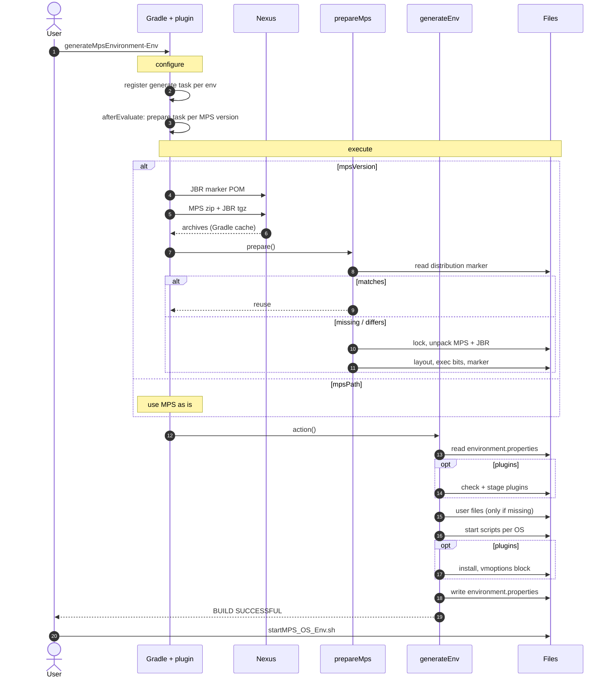

# Gradle flow

What happens on `./gradlew generateMpsEnvironment-<Env>`.

```mermaid
sequenceDiagram
    autonumber
    actor U as User
    participant G as Gradle + plugin
    participant N as Nexus
    participant P as prepareMps
    participant E as generateEnv
    participant F as Files

    U->>G: generateMpsEnvironment-Env
    Note over G: configure
    G->>G: register generate task per env
    G->>G: afterEvaluate: prepare task per MPS version

    Note over G,F: execute
    alt mpsVersion
        G->>N: JBR marker POM
        G->>N: MPS zip + JBR tgz
        N-->>G: archives (Gradle cache)
        G->>P: prepare()
        P->>F: read distribution marker
        alt matches
            P-->>G: reuse
        else missing / differs
            P->>F: lock, unpack MPS + JBR
            P->>F: layout, exec bits, marker
        end
    else mpsPath
        Note over G: use MPS as is
    end

    G->>E: action()
    E->>F: read environment.properties
    opt plugins
        E->>F: check + stage plugins
    end
    E->>F: user files (only if missing)
    E->>F: start scripts per OS
    opt plugins
        E->>F: install, vmoptions block
    end
    E->>F: write environment.properties
    E-->>U: BUILD SUCCESSFUL
    U->>F: startMPS_OS_Env.sh
```
